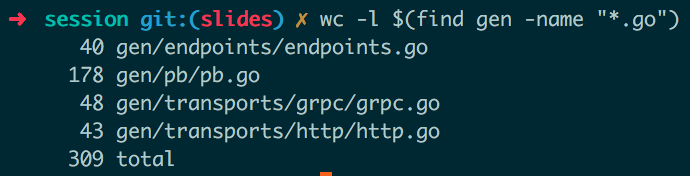
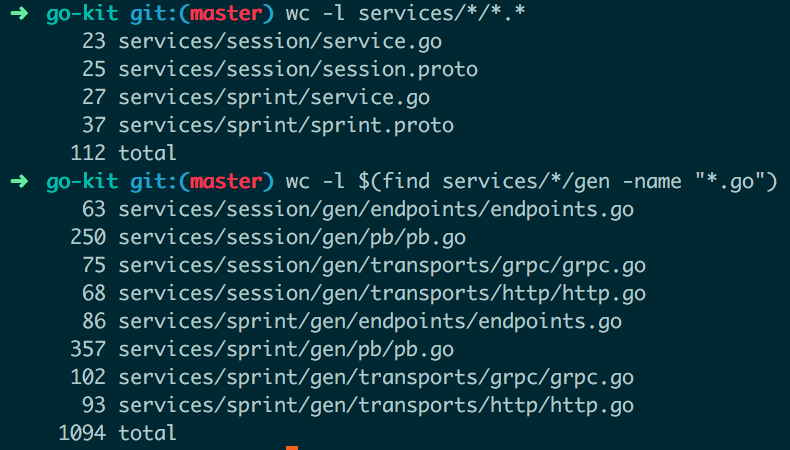

# [fit] Protobuf & Code Generation

### 2016, by Manfred Touron (@moul)

---

# overview

* go-kit is an amazing framework to develop strong micro services
* but it requires a lot of boilerplate code
* return on experience on go-kit boilerplate code generation

---

# protobuf?

* limited to exchanges (methods and models)
* extendable with plugins
* contract-based
* universal

---

# code generation?

* the good old ./generate.sh bash script
* go:generate
* make
* protobuf + [protoc-gen-gotemplate](https://github.com/moul/protoc-gen-gotemplate)

---

# go-kit

* protobuf-first, rpc-first service framework in Golang
* abstract services, endpoints, transports
* requires a lot of boilerplate code in multiple packages

---

# example: `session.proto`

```protobuf
syntax = "proto3";
package session;

service SessionService {
  rpc Login(LoginRequest) returns (LoginResponse) {}
}

message LoginRequest {
  string username = 1;
  string password = 2;
}

message LoginResponse {
  string token = 1;
  string err_msg = 2;
}
```

---

# example: `session.go`

```go
package sessionsvc

import (
	"fmt"
	"golang.org/x/net/context"
	pb "github.com/moul/protoc-gen-gotemplate/examples/go-kit/services/session/gen/pb"
)

type Service struct{}

func New() pb.SessionServiceServer {
	return &Service{}
}

func (svc *Service) Login(ctx context.Context, in *pb.LoginRequest) (*pb.LoginResponse, error) {
    // custon code here
	return nil, fmt.Errorf("not implemented")
}
```

---

##### example: `{{.File.Package}}/gen/transports/http/http.go.tmpl`

```go
// source: templates/{{.File.Package}}/gen/transports/http/http.go.tmpl
package {{.File.Package}}_httptransport
import (
    gokit_endpoint "github.com/go-kit/kit/endpoint"
	httptransport "github.com/go-kit/kit/transport/http"
	endpoints "github.com/moul/protoc-gen-gotemplate/examples/go-kit/services/{{.File.Package}}/gen/endpoints"
	pb "github.com/moul/protoc-gen-gotemplate/examples/go-kit/services/{{.File.Package}}/gen/pb"
)
```

```go
// result: services/user/gen/transports/http/http.go
package user_httptransport
import (
	gokit_endpoint "github.com/go-kit/kit/endpoint"
	httptransport "github.com/go-kit/kit/transport/http"
	endpoints "github.com/moul/protoc-gen-gotemplate/examples/go-kit/services/user/gen/endpoints"
	pb "github.com/moul/protoc-gen-gotemplate/examples/go-kit/services/user/gen/pb"
)
```

---

##### example: `{{.File.Package}}/gen/transports/http/http.go.tmpl`

```go
// source: templates/{{.File.Package}}/gen/transports/http/http.go.tmpl
{{range .Service.Method}}
func Make{{.Name}}Handler(ctx context.Context, svc pb.{{$file.Package | title}}ServiceServer, endpoint gokit_endpoint.Endpoint) *httptransport.Server {
	return httptransport.NewServer(
		ctx,
		endpoint,
		decode{{.Name}}Request,
		encode{{.Name}}Response,
                []httptransport.ServerOption{}...,
	)
}
{{end}}
```

```go
// result: services/user/gen/transports/http/http.go
func MakeGetUserHandler(ctx context.Context, svc pb.UserServiceServer, endpoint gokit_endpoint.Endpoint) *httptransport.Server {
	return httptransport.NewServer(
		ctx,
		endpoint,
		decodeGetUserRequest,
		encodeGetUserResponse,
		[]httptransport.ServerOption{}...,
	)
}
```

---

##### example: `{{.File.Package}}/gen/transports/http/http.go.tmpl`

```go
// source: templates/{{.File.Package}}/gen/transports/http/http.go.tmpl
func RegisterHandlers(ctx context.Context, svc pb.{{$file.Package | title}}ServiceServer, mux *http.ServeMux, endpoints endpoints.Endpoints) error {
	{{range .Service.Method}}
        log.Println("new HTTP endpoint: \"/{{.Name}}\" (service={{$file.Package | title}})")
	mux.Handle("/{{.Name}}", Make{{.Name}}Handler(ctx, svc, endpoints.{{.Name}}Endpoint))
	{{end}}
	return nil
}
```

```go
// result: services/user/gen/transports/http/http.go
func RegisterHandlers(ctx context.Context, svc pb.UserServiceServer, mux *http.ServeMux, endpoints endpoints.Endpoints) error {

	log.Println("new HTTP endpoint: \"/CreateUser\" (service=User)")
	mux.Handle("/CreateUser", MakeCreateUserHandler(ctx, svc, endpoints.CreateUserEndpoint))

	log.Println("new HTTP endpoint: \"/GetUser\" (service=User)")
	mux.Handle("/GetUser", MakeGetUserHandler(ctx, svc, endpoints.GetUserEndpoint))

	return nil
}
```

---

#### `protoc --gogo_out=plugins=grpc:. ./services/*/*.proto`

---

#### `protoc --gotemplate_out=template_dir=./templates:services ./services/*/*.proto`

---



---



## 3 services
## 6 methods
## 149 custom lines
## 1429 generated lines
## business focus

---

# generation usages

* go-kit boilerplate (see [examples/go-kit](https://github.com/moul/protoc-gen-gotemplate/tree/master/examples/go-kit))
* k8s configuration
* Dockerfile
* documentation
* unit-tests
* fun

---

# pros

* small custom codebase
* templates shipped with code
* hardly typed, no reflects
* genericity
* contrat terms (protobuf) respected
* not limited to a language

---

# cons

* the author needs to write its own templates
* sometimes difficult to generate valid code
* not enough helpers around the code generation yet

---

# improvement ideas

* Support protobufs extensions (i.e, annotations.probo)
* Generate one file from multiple services
* Add more helpers around the code generation

---

# conclusion

* Useful to keep everything standard
* The awesomeness of go-kit without the hassle of writing boilerplate code
* Always up-to-date with the contracts

---

# questions?

### github.com/moul/protoc-gen-gotemplate
### @moul
