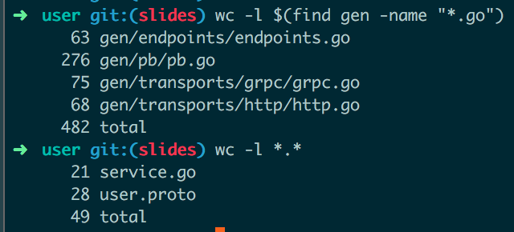

# [fit] Protobuf & Code Generation

### 2016, by Manfred Touron (@moul)

---

# overview

* blah blah

---

# protobuf?

* limited to exchanges (methods and models)
* extendable with plugins
* contract-based
* universal

---

# code generation?

* the good old ./generate.sh bash script
* go:generate
* make
* protobuf + [protoc-gen-gotemplate](https://github.com/moul/protoc-gen-gotemplate)

---

# example: `session.proto`

```protobuf
syntax = "proto3";
package session;

service SessionService {
  rpc Login(LoginRequest) returns (LoginResponse) {}
}

message LoginRequest {
  string username = 1;
  string password = 2;
}

message LoginResponse {
  string token = 1;
  string err_msg = 2;
}
```

---

# example: `session.go`

```go
package sessionsvc

import (
	"fmt"
	"golang.org/x/net/context"
	pb "github.com/moul/protoc-gen-gotemplate/examples/go-kit/services/session/gen/pb"
)

type Service struct{}

func New() pb.SessionServiceServer {
	return &Service{}
}

func (svc *Service) Login(ctx context.Context, in *pb.LoginRequest) (*pb.LoginResponse, error) {
    // custon code here
	return nil, fmt.Errorf("not implemented")
}
```

---




---


## 3 services
## 6 methods
## 149 custom lines
## 1429 generated lines
## business focus

---

# generation usages

* go-kit boilerplate (see [examples/go-kit](https://github.com/moul/protoc-gen-gotemplate/tree/master/examples/go-kit))
* k8s configuration
* Dockerfile
* documentation
* unit-tests
* fun

---

# pros

* small custom codebase
* templates shipped with code
* hardly typed, no reflects
* genericity
* contrat terms (protobuf) respected
* not limited to a language

---

# cons

* the author needs to write its own templates
*

---

# improvement ideas

* Support protobufs extensions (i.e, annotations.probo)
* Generate one file from multiple services
* Add more helpers around the code generation

---

# conclusion

* blah blah

---

# questions?

### github.com/moul/protoc-gen-gotemplate
### @moul
